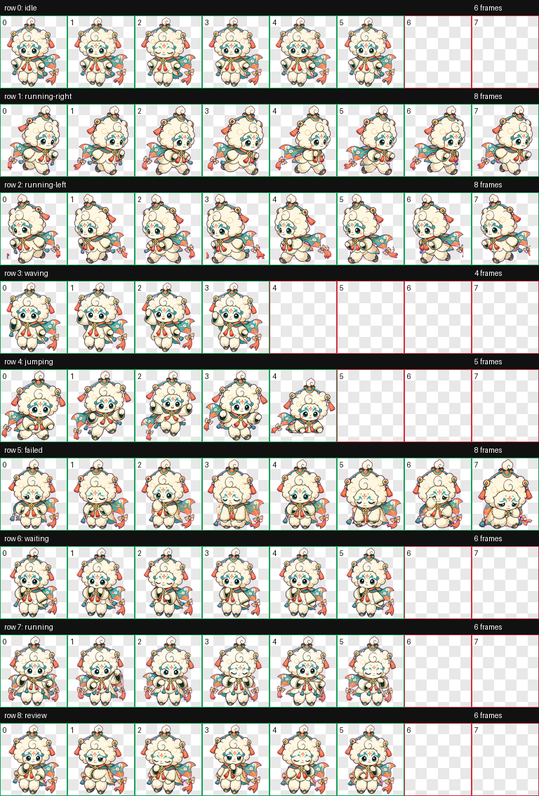

# Yunou Codex Pet

Yunou is an original animated Codex pet inspired by cloud-puppet theater, kite ornaments, soft cloud shapes, ribbon tassels, and elegant opera-style face markings.

It is designed as a compact sticker-style mascot with a teal, coral, gold, ivory, and charcoal palette. The character is original and is not affiliated with or copied from any existing game, character, skin, logo, or official asset.

## Contents

- `pets/yunou/pet.json` - Codex pet manifest
- `pets/yunou/spritesheet.webp` - final 9-state animated pet atlas
- `qa/contact-sheet.png` - visual QA contact sheet
- `qa/previews/*.gif` - per-state animation previews
- `qa/validation.json` - atlas validation output
- `qa/review.json` - frame inspection output

## Install

Copy the `pets/yunou` folder into your Codex pets directory:

```powershell
Copy-Item -Recurse -Force .\pets\yunou "$env:USERPROFILE\.codex\pets\yunou"
```

Then select or reload the pet in Codex.

## Atlas

- Size: `1536x1872`
- Cell size: `192x208`
- Rows: 9
- Format: WebP with alpha

States:

1. `idle`
2. `running-right`
3. `running-left`
4. `waving`
5. `jumping`
6. `failed`
7. `waiting`
8. `running`
9. `review`

## QA

The generated atlas was checked with the hatch-pet validation scripts.

- `validation.json`: no errors, no warnings
- `review.json`: no errors, no warnings
- transparent RGB residue pixels: `0`



## License

This repository is licensed under CC BY 4.0. See `LICENSE` for details.
